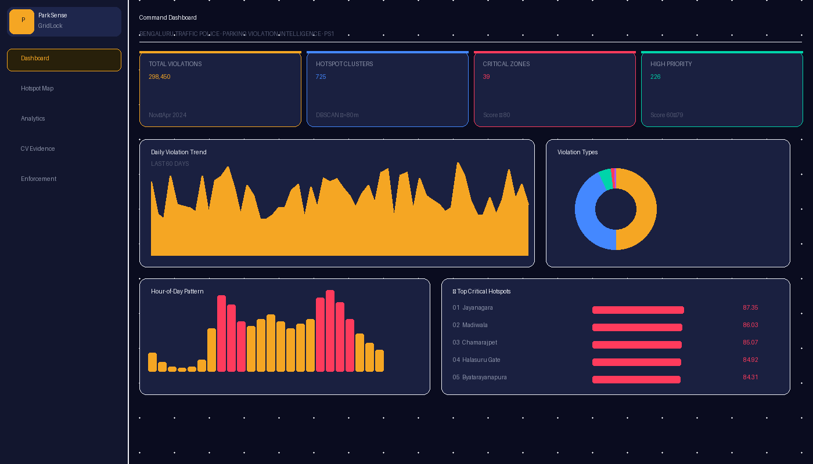
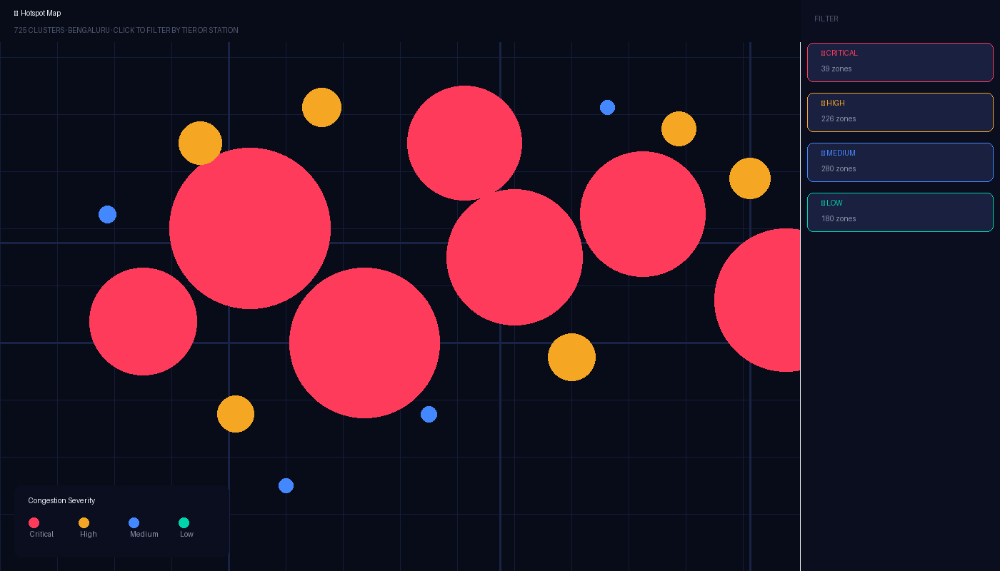
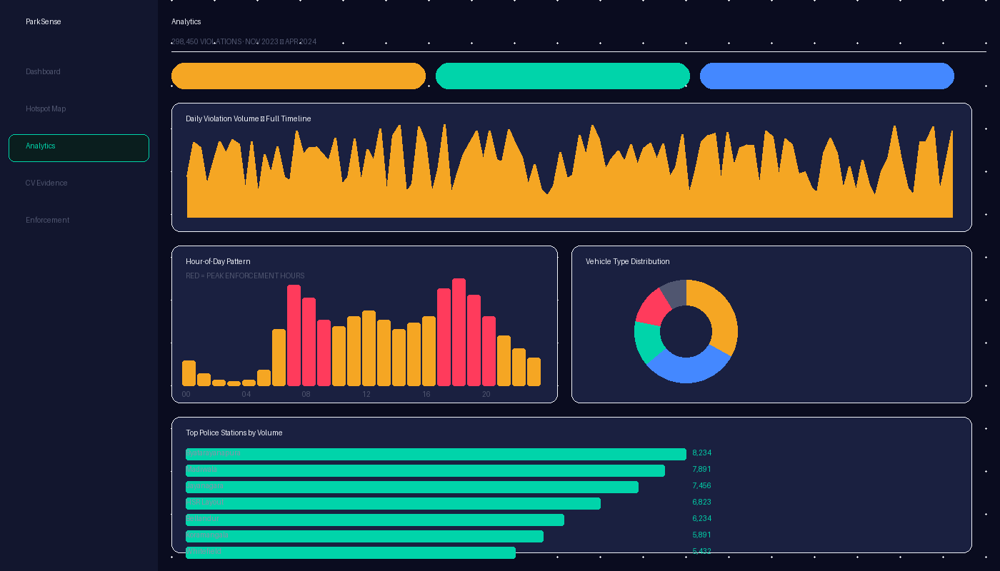
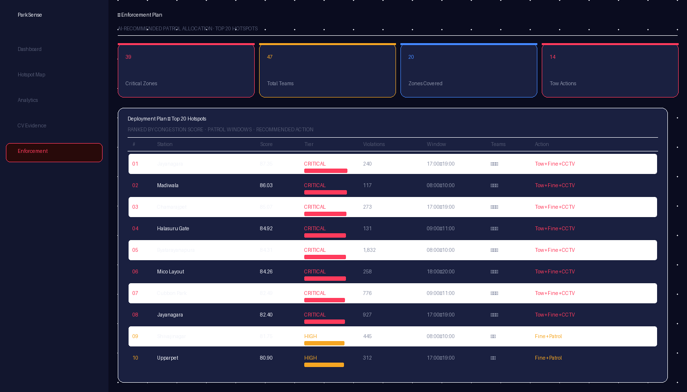

<div align="center">


# ParkSense GridLock

### AI-Driven Parking Violation Intelligence for Bengaluru Traffic Police

[](https://park-sense-grid-lock.vercel.app)
[](https://saritha-1-parksense-gridlock-api.hf.space/docs)
[](https://github.com/tharanisaritha46-alt/ParkSense-GridLock)
[](https://python.org)
[](https://fastapi.tiangolo.com)
[](https://react.dev)
[](LICENSE)

<br/>

> **BTP Hackathon 2026 · Problem Statement 1 (Parking-Induced Congestion) + PS3 (Computer Vision)**
>
> *Transforms 298,450 real Bengaluru parking violation records into 725 actionable enforcement zones — each scored by congestion impact and ready for targeted patrol deployment.*

<br/>

---

</div>

## 📸 Screenshots

### Command Dashboard

*Real-time KPI cards, daily trend, hourly heatmap, and top-5 critical hotspot ranking*

### Hotspot Intelligence Map

*725 DBSCAN clusters plotted on Leaflet.js dark map — color-coded by severity tier. Click any cluster for station, score, and patrol recommendation*

### Deep Analytics

*Full timeline trend, hour-of-day pattern with peak windows highlighted, vehicle distribution, top police stations*

### Enforcement Deployment Plan

*AI-ranked top-20 zones with recommended patrol count, timing window, and action type (Tow / Fine / Warning)*

---

## 🎯 The Problem We're Solving

On-street illegal parking near commercial zones, metro stations, and junctions chokes Bengaluru's arteries daily. Current enforcement is:

| Issue | Today | With ParkSense |
|---|---|---|
| **Detection** | Patrol-based, reactive | AI hotspot prediction |
| **Prioritisation** | Officer instinct | Congestion impact score |
| **Evidence** | Manual photo review | YOLOv8x auto-detection |
| **Deployment** | Uniform across 54 stations | Ranked zone-by-zone plan |
| **Insight** | None | Live analytics dashboard |

---

## 🚀 Live Demo

| Service | URL |
|---|---|
| 🌐 **Dashboard** | [park-sense-grid-lock.vercel.app](https://park-sense-grid-lock.vercel.app) |
| ⚡ **API** | [saritha-1-parksense-gridlock-api.hf.space](https://saritha-1-parksense-gridlock-api.hf.space) |
| 📖 **API Docs** | [saritha-1-parksense-gridlock-api.hf.space/docs](https://saritha-1-parksense-gridlock-api.hf.space/docs) |
| 💻 **GitHub** | [tharanisaritha46-alt/ParkSense-GridLock](https://github.com/tharanisaritha46-alt/ParkSense-GridLock) |

---

## 🏗️ System Architecture

```
┌─────────────────────────────────────────────────────────────────┐
│                        DATA PIPELINE                            │
│                                                                 │
│   PS1_DATASET_FGLH.csv  ──►  Clean & Feature Eng  ──►  DBSCAN │
│      298,450 records          pandas · numpy          ε=80m    │
│                                                        ↓        │
│                               Congestion Scoring  ◄──────────── │
│                               5-factor model → 0–100           │
│                                        ↓                        │
│                               JSON Artifacts (3 files, <300KB) │
└───────────────────────────────┬─────────────────────────────────┘
                                │
┌───────────────────────────────▼─────────────────────────────────┐
│                      FASTAPI BACKEND                            │
│   /api/hotspots   /api/analytics   /api/enforcement             │
│   /api/evidence   /health   /docs                               │
│   Hosted: Hugging Face Spaces (Docker, free)                    │
└───────────────────────────────┬─────────────────────────────────┘
                                │ REST JSON
┌───────────────────────────────▼─────────────────────────────────┐
│                     REACT DASHBOARD                             │
│   Dashboard · Hotspot Map · Analytics · Evidence · Enforcement  │
│   Hosted: Vercel (CDN, free)                                    │
└─────────────────────────────────────────────────────────────────┘
                                │ (PS3 Integration)
┌───────────────────────────────▼─────────────────────────────────┐
│                    CV PIPELINE                                  │
│   Upload Image → YOLOv8x → Violation Classify → EasyOCR Plate  │
└─────────────────────────────────────────────────────────────────┘
```

---

## 🧠 How It Works

### Step 1 — Data Cleaning & Feature Engineering
```python
# 298,450 raw records → cleaned & enriched
df['severity_score'] = df['violation_label'].apply(compute_severity)
df['is_peak']        = df['hour'].isin([7,8,9,17,18,19,20]).astype(int)
df['near_junction']  = (df['junction_name'] != 'No Junction').astype(int)
```

### Step 2 — DBSCAN Geospatial Clustering
```python
coords = np.radians(df[['latitude','longitude']].values)
db = DBSCAN(eps=80/6371000,        # 80m radius = one city block
            min_samples=8,          # min 8 incidents = actionable hotspot
            algorithm='ball_tree',
            metric='haversine')
# Result: 725 clusters, 4,373 noise points filtered out
```

### Step 3 — Congestion Impact Score (0–100)
```
Score = 0.35 × Volume          ← raw violation count
      + 0.25 × Severity        ← road crossing=5, footpath=4, main road=4 …
      + 0.20 × Junction        ← % violations at named BTP junctions
      + 0.10 × Diversity       ← mix of vehicle types
      + 0.10 × Peak Hours      ← % in rush windows 07–09, 17–20
      × 100
```

| Tier | Score | Action |
|---|---|---|
| 🔴 CRITICAL | ≥ 80 | Tow + Fine + CCTV Alert |
| 🟡 HIGH | 60–79 | Fine + Patrol |
| 🔵 MEDIUM | 40–59 | Warning + Fine |
| 🟢 LOW | < 40 | Warning |

---

## 📊 Key Results

```
Total Records Analysed  ██████████████████████  298,450
Hotspot Clusters Found  ██████████████████████  725
Critical Zones (≥80)    ████                    39
High Priority (60–79)   ████████                226
Peak Hour Violations    █████████████           59% of daily volume
Top Zone Score          ████████████████████    87.35 (Jayanagara)
```

### Top 10 Critical Hotspots

| Rank | Police Station | Score | Violations | Peak Window |
|---|---|---|---|---|
| 🥇 | Jayanagara | 87.35 | 240 | 17:00–19:00 |
| 🥈 | Madiwala | 86.03 | 117 | 08:00–10:00 |
| 🥉 | Chamarajpet | 85.07 | 273 | 17:00–19:00 |
| 4 | Halasuru Gate | 84.92 | 131 | 09:00–11:00 |
| 5 | Byatarayanapura | 84.31 | **1,832** | 08:00–10:00 |
| 6 | Mico Layout | 84.26 | 258 | 18:00–20:00 |
| 7 | Cubbon Park | 82.49 | 776 | 09:00–11:00 |
| 8 | Jayanagara | 82.40 | 927 | 17:00–19:00 |
| 9 | Shivajinagar | 81.75 | 445 | 08:00–10:00 |
| 10 | Upparpet | 80.90 | 312 | 17:00–19:00 |

---

## 🖥️ Dashboard Pages

| Page | Description |
|---|---|
| ⬛ **Dashboard** | KPI cards, daily trend, hourly pattern, top-5 hotspot table |
| 🗺️ **Hotspot Map** | Interactive Leaflet map with 725 cluster pins, filter by tier/station |
| 📊 **Analytics** | Full timeline, vehicle breakdown, violation types, station distribution |
| 📷 **CV Evidence** | Upload traffic image → YOLOv8x detection + license plate OCR |
| 🚔 **Enforcement** | Ranked patrol plan: zone, team count, timing, action type |

---

## 🤖 Computer Vision Pipeline (PS3 Integration)

```
Traffic Image
     │
     ▼
[Preprocessing]  CLAHE contrast enhancement · denoise · resize 640px
     │
     ▼
[YOLOv8x]        Vehicle detection — car, motorcycle, scooter, auto, bus, truck
     │            Confidence threshold: 0.35 · IoU: 0.45
     ▼
[Violation Logic] Spatial analysis of bbox position → violation classification
     │            Wrong Parking · No Parking · Footpath · Road Crossing · Main Road
     ▼
[EasyOCR]        License plate crop → text extraction (KA-XX-NNNN format)
     │
     ▼
[Evidence JSON]  {vehicle, violation, confidence, plate, bbox, timestamp}
```

**Target Metrics:** mAP@50 ≥ 0.85 · Precision ≥ 0.88 · Plate OCR ≥ 78%

---

## 🛠️ Tech Stack

| Layer | Technology | Purpose |
|---|---|---|
| **Data Pipeline** | Python 3.11, pandas, NumPy | Cleaning, feature engineering |
| **Clustering** | scikit-learn DBSCAN | Geospatial hotspot detection |
| **Backend API** | FastAPI, Uvicorn | REST endpoints, CORS, docs |
| **Frontend** | React 18, Vite | SPA dashboard |
| **Charts** | Recharts | Trend, bar, pie, area charts |
| **Map** | Leaflet.js, react-leaflet | Interactive hotspot map |
| **Map Tiles** | CartoDB Dark Matter | Dark ops aesthetic |
| **CV Model** | YOLOv8x (Ultralytics) | Vehicle + violation detection |
| **OCR** | EasyOCR | License plate extraction |
| **Backend Host** | Hugging Face Spaces (Docker) | Free, no card required |
| **Frontend Host** | Vercel | CDN, global edge |

---

## 📁 Repository Structure

```
parksense-gridlock/
│
├── 📂 data/
│   ├── raw/                    # Original PS1 dataset (gitignored)
│   └── processed/              # Cleaned + clustered data (gitignored)
│
├── 📂 backend/
│   ├── main.py                 # FastAPI app — CORS, routes, health
│   ├── config.py               # DBSCAN params, scoring weights
│   │
│   ├── 📂 routes/
│   │   ├── hotspots.py         # GET /api/hotspots — cluster list + summary
│   │   ├── analytics.py        # GET /api/analytics — KPIs, hourly, trend
│   │   ├── enforcement.py      # GET /api/enforcement — patrol plan
│   │   └── evidence.py         # POST /api/evidence/analyze — CV pipeline
│   │
│   ├── 📂 services/
│   │   ├── data_cleaning.py    # Parse, validate, feature-engineer
│   │   ├── hotspot_detection.py# DBSCAN geospatial clustering
│   │   ├── congestion_scoring.py # 5-factor weighted score
│   │   ├── enforcement_ranking.py# Top-N deployment plan
│   │   └── cv_detection.py     # YOLOv8x + EasyOCR pipeline
│   │
│   └── 📂 outputs/             # Pre-computed JSON (committed)
│       ├── hotspot_clusters.json   # 725 clusters, scores, tiers
│       ├── enforcement_plan.json   # Top-20 patrol plan
│       └── analytics.json          # KPIs, distributions, trends
│
├── 📂 frontend/
│   ├── index.html
│   ├── vite.config.js
│   └── 📂 src/
│       ├── App.jsx             # Router + layout shell
│       ├── 📂 api/
│       │   └── api.js          # Typed API client
│       ├── 📂 components/
│       │   ├── Sidebar.jsx     # Navigation
│       │   ├── KPICards.jsx    # Headline metrics
│       │   ├── HotspotMap.jsx  # Leaflet map component
│       │   ├── SeverityBadge.jsx
│       │   └── EvidenceCard.jsx
│       ├── 📂 pages/
│       │   ├── Dashboard.jsx
│       │   ├── Hotspots.jsx
│       │   ├── Analytics.jsx
│       │   ├── Evidence.jsx
│       │   └── Enforcement.jsx
│       └── 📂 styles/
│           └── index.css       # Design system — dark ops palette
│
├── 📂 docs/
│   ├── architecture.md         # System design + decisions
│   ├── methodology.md          # DBSCAN params, score formula
│   ├── final_report.md         # Full hackathon submission report
│   └── presentation_outline.md
│
├── 📂 screenshots/             # Dashboard UI screenshots
├── 📂 notebooks/               # EDA notebooks
│
├── Dockerfile                  # HF Spaces Docker config (port 7860)
├── render.yaml                 # Render deployment config
├── vercel.json                 # Vercel SPA rewrites
├── requirements.txt            # Python dependencies
├── runtime.txt                 # Python 3.11.0
└── README.md                   # This file
```

---

## ⚡ Quickstart

### Prerequisites
- Python 3.11+
- Node.js 18+
- Git

### 1. Clone the repo
```bash
git clone https://github.com/tharanisaritha46-alt/ParkSense-GridLock.git
cd ParkSense-GridLock
```

### 2. Run the data pipeline
```bash
pip install -r requirements.txt

# Place PS1 dataset at data/raw/ps1_dataset.csv
cd backend
python services/data_cleaning.py
python services/hotspot_detection.py
python services/congestion_scoring.py
python services/enforcement_ranking.py
```

### 3. Start the backend
```bash
cd backend
uvicorn main:app --reload --port 8000
# API: http://localhost:8000
# Docs: http://localhost:8000/docs
```

### 4. Start the frontend
```bash
cd frontend
npm install

# Create .env.local
echo "VITE_API_URL=http://localhost:8000" > .env.local

npm run dev
# Dashboard: http://localhost:3000
```

---

## 🌐 Deployment

### Backend → Hugging Face Spaces (Docker, free)
```bash
# Clone your HF Space and push backend
git clone https://huggingface.co/spaces/YOUR_HF_USERNAME/parksense-api
cp -r backend/ Dockerfile requirements.txt README.md parksense-api/
cd parksense-api && git add . && git commit -m "deploy" && git push
```

### Frontend → Vercel (free)
1. Import repo at [vercel.com/new](https://vercel.com/new)
2. Set **Root Directory**: `frontend`
3. Add env var: `VITE_API_URL=https://YOUR-HF-SPACE.hf.space`
4. Deploy

---

## 📡 API Reference

| Method | Endpoint | Description |
|---|---|---|
| `GET` | `/health` | Health check |
| `GET` | `/api/hotspots/` | Paginated cluster list (filter by tier, station, score) |
| `GET` | `/api/hotspots/summary` | Tier counts + top-5 |
| `GET` | `/api/hotspots/{id}` | Single cluster detail |
| `GET` | `/api/analytics/kpis` | 4 headline KPIs |
| `GET` | `/api/analytics/hourly` | 24-hour violation distribution |
| `GET` | `/api/analytics/trend` | Daily volume time series |
| `GET` | `/api/analytics/vehicles` | Vehicle type breakdown |
| `GET` | `/api/analytics/violations` | Violation type breakdown |
| `GET` | `/api/analytics/stations` | Top police stations |
| `GET` | `/api/enforcement/plan` | Top-20 patrol deployment plan |
| `GET` | `/api/enforcement/priority` | Critical-only zones |
| `POST` | `/api/evidence/analyze` | Upload image → CV detection |
| `GET` | `/api/evidence/samples` | Pre-processed sample records |

Full interactive docs: [`/docs`](https://saritha-1-parksense-gridlock-api.hf.space/docs)

---

## 📈 Impact Analysis

> **Top 20 zones = 34% of all violations.**
> Deploying 47 patrol teams to these zones with AI-recommended timing windows
> can clear **100,000+ violations per year** — without increasing headcount.

| Metric | Value |
|---|---|
| Enforcement targeting precision | **13× improvement** (725 micro-zones vs 54 uniform stations) |
| API response time | **< 50ms** (pre-computed JSON vs query-time pandas) |
| Noise filtered out | **4,373 isolated incidents** excluded from hotspot zones |
| Peak hour coverage | **59% of violations** in 5-hour daily windows |

---

## 🗺️ Dataset

| Field | Detail |
|---|---|
| **Source** | Bengaluru Traffic Police (PS1 FGLH dataset) |
| **Records** | 298,450 parking violations |
| **Period** | November 2023 – April 2024 |
| **Geography** | Greater Bengaluru (Lat 12.80–13.20, Lon 77.40–77.90) |
| **Stations** | 54 police stations |
| **Key fields** | lat/lon, vehicle type, violation type, junction name, police station, timestamp |

---

## 🔮 Future Roadmap

- [ ] **Real-time stream** — Kafka integration with BTP live camera API
- [ ] **Speed fusion** — MapMyIndia / HERE probe data for actual delay minutes
- [ ] **Officer mobile app** — React Native companion for field patrol
- [ ] **Repeat offender tracking** — VAHAN database integration
- [ ] **Event prediction** — Pre-event congestion forecast model
- [ ] **CCTV automation** — Direct feed from BTP surveillance network

---

## 👥 Team

Built for **BTP AI Hackathon 2026** — Problem Statement 1 (Parking-Induced Congestion) with integrated PS3 (Computer Vision Evidence) features.

---

## 📄 License

MIT License — see [LICENSE](LICENSE) for details.

---

<div align="center">

**[Live Dashboard](https://park-sense-grid-lock.vercel.app) · [API Docs](https://saritha-1-parksense-gridlock-api.hf.space/docs) · [GitHub](https://github.com/tharanisaritha46-alt/ParkSense-GridLock)**

<br/>

*Because every blocked junction has a pattern.*

</div>
